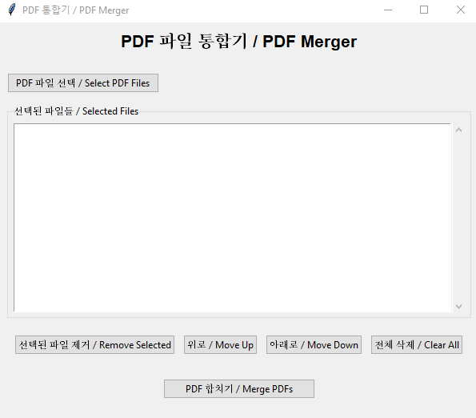

# 📄 PDF Merger – Simple & Fast PDF Combining Tool (Python GUI)

**Merge multiple PDF files into one – with just a few clicks.**  
A lightweight desktop application built with Python and Tkinter.

---

## ✅ Features

- 📂 Select 2 or more PDF files
- 🔼🔽 Reorder files before merging
- 💾 Choose where to save the output file
- 🖱️ Simple GUI interface (no command line needed)
- ⚙️ Runs as a standalone `.exe` (no installation required)
- 🌐 Bilingual UI (Korean + English)

---

## 📦 Download

👉 [Download the latest version from the Releases tab](https://github.com/USERNAME/pdf-merger-gui/releases)

Contents of the ZIP package:
- `pdf_merger.exe` – Executable file  
- `README_KR.txt` – Korean instruction  
- `pdf-merger.ico` – Icon file (optional)

---

## 🛠 Built With

- Python 3.10
- Tkinter (GUI)
- PyPDF2 (PDF processing)
- PyInstaller (for `.exe` packaging)

---

## 🚀 How to Use

### Option 1: Use the pre-built `.exe` (Windows)
1. Download `pdf_merger.exe` from [Releases](https://github.com/USERNAME/pdf-merger-gui/releases)
2. Double-click to launch the GUI
3. Select PDFs → Arrange order → Click **Merge PDFs**

### Option 2: Run the source code
```bash
pip install PyPDF2
python pdf_merger.py


## 🖼️ Screenshot

Here’s how the PDF Merger looks:

